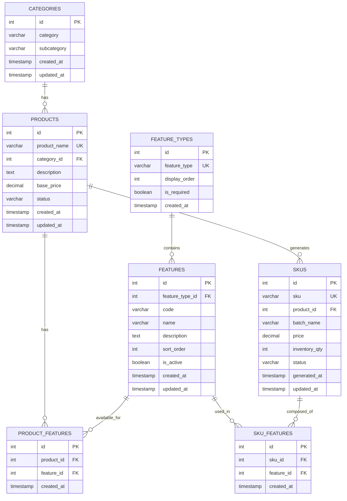

# Database Schema Diagram

```mermaid
erDiagram
    CATEGORIES ||--o{ PRODUCTS : "has"
    PRODUCTS ||--o{ PRODUCT_FEATURES : "has"
    PRODUCTS ||--o{ SKUS : "generates"
    FEATURE_TYPES ||--o{ FEATURES : "contains"
    FEATURES ||--o{ PRODUCT_FEATURES : "available_for"
    FEATURES ||--o{ SKU_FEATURES : "used_in"
    SKUS ||--o{ SKU_FEATURES : "composed_of"
    
    CATEGORIES {
        int id PK
        varchar category
        varchar subcategory
        timestamp created_at
        timestamp updated_at
    }
    
    PRODUCTS {
        int id PK
        varchar product_name UK
        int category_id FK
        text description
        decimal base_price
        varchar status
        timestamp created_at
        timestamp updated_at
    }
    
    FEATURE_TYPES {
        int id PK
        varchar feature_type UK
        int display_order
        boolean is_required
        timestamp created_at
    }
    
    FEATURES {
        int id PK
        int feature_type_id FK
        varchar code
        varchar name
        text description
        int sort_order
        boolean is_active
        timestamp created_at
        timestamp updated_at
    }
    
    PRODUCT_FEATURES {
        int id PK
        int product_id FK
        int feature_id FK
        timestamp created_at
    }
    
    SKUS {
        int id PK
        varchar sku UK
        int product_id FK
        varchar batch_name
        decimal price
        int inventory_qty
        varchar status
        timestamp generated_at
        timestamp updated_at
    }
    
    SKU_FEATURES {
        int id PK
        int sku_id FK
        int feature_id FK
        timestamp created_at
    }
```
